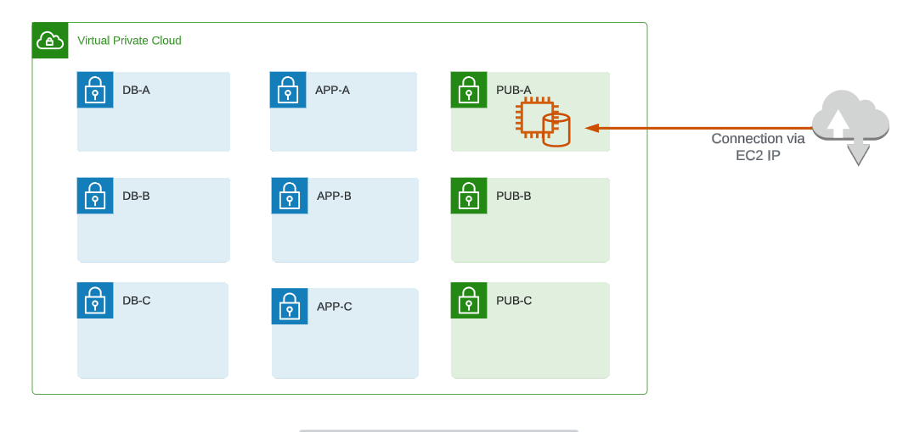
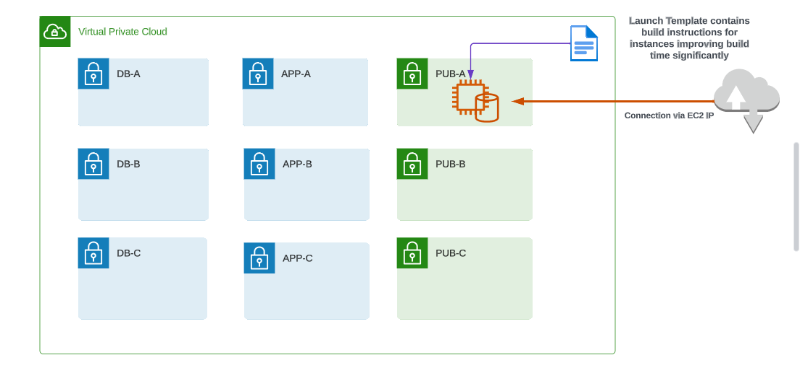
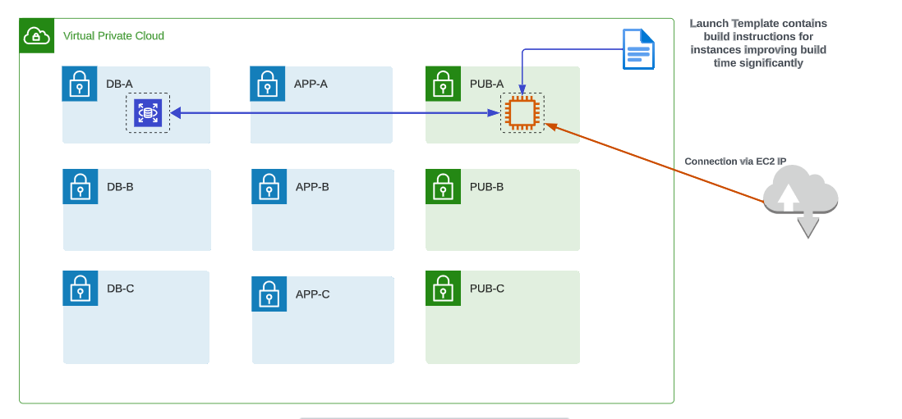
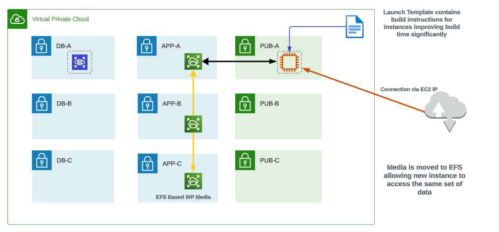
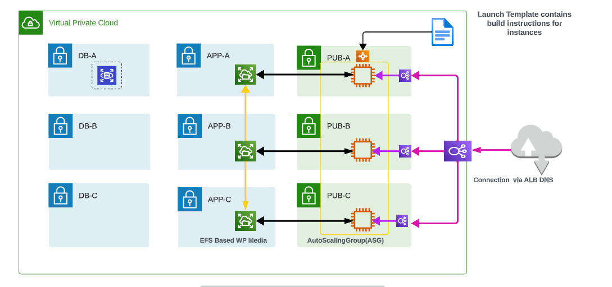

# AWS Elastic WordPress Evolution

Companies often upgrade their server infrastructure from a single server to a more reliable, fault-tolerant and scalable architecture. This shift helps them better handle high-traffic loads, minimize downtime, and improve overall system performance. It also allows them to adapt to changing demands, ensuring uninterrupted service availability, which is essential for modern high-performance applications.

To begin the process, a single EC2 instance running the WordPress engine and database is set up. This instance stores all blog post content locally, and it is manually built to understand the different components required for the functional operation of the web application.

After manually building the instance, the process is replicated using a launch template to automate the provisioning of the web application. 

The next step involves database migration, moving the MySQL database from the EC2 instance to a dedicated RDS instance. This separation ensures that the database exists outside the lifecycle of the EC2 instance.

Following the successful migration of the database, content storage is shifted from the EC2 instance to an Elastic File System (EFS). EFS, a network-based resilient shared file system, is used to migrate all WordPress application content, providing improved flexibility.

The subsequent phase involves provisioning an Auto Scaling Group (ASG) instead of connecting to a single EC2 instance. This allows instance scaling based on demand. An Elastic Load Balancer (ELB) is configured to direct traffic to the ASG, abstracting connectivity away from individual instances. This ensures a fully resilient, self-healing, and elastically scalable system.

### For detailed instructions and to execute this project, you can refer to Adrian Cantrill's comprehensive video guide and text instructions available on [GitHub](https://github.com/acantril/learn-cantrill-io-labs/tree/master/aws-elastic-wordpress-evolution). Follow his step-by-step instructions to experience the full functionality of the web application.

## Web Application Evolutuion: Badminton Court Upgrade Project Reference.

Imagine upgrading your badminton setup from playing on a single court to a more advanced and efficient arrangement. This helps you handle more players, reduce waiting times, and overall enhance the game experience. It's like leveling up your game strategy to adapt to different player demands, ensuring everyone can enjoy a seamless badminton session.

To kick off this upgrade, think of setting up a single badminton court with a specific type of racket and shuttlecock. You build this setup manually, understanding how each element contributes to the game's smooth operation.

Once you've got the hang of it, you create a blueprint (like a launch template) to automate setting up new courts, making it faster and less prone to mistakes. Now, imagine transferring the responsibility of keeping track of game scores to a dedicated scorekeeper instead of relying on a player – that's similar to moving the game's "score database" to a specialized system.

After successfully migrating this scorekeeping responsibility, you decide to store the game equipment, like extra shuttlecocks and rackets, in a central storage area (Elastic File System). This makes it easier to manage and ensures you always have the necessary equipment available.

Next, instead of having players sign up for a single court, you introduce an automated system (Auto Scaling Group) that adjusts the number of available courts based on the number of players. It's like having more courts available during peak times and fewer during quieter periods. You also set up a designated person (Elastic Load Balancer) to direct players to the available courts, making the process smoother and less dependent on individual players.
